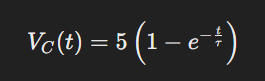

# Monitor de Voltaje en Tiempo Real

Este proyecto utiliza un Arduino Nano y una interfaz gráfica en Python para visualizar en tiempo real el voltaje de un capacitor en un circuito RC. El programa permite iniciar y reiniciar la medición y mostrar la respuesta del circuito en una gráfica actualizada en tiempo real.

## Requisitos

### Hardware

- **Arduino Nano**
- **Resistencia de 1.8 MΩ**
- **Capacitor de 10 μF**
- **Cable USB** para la conexión del Arduino
- **Protoboard y cables de conexión**

### Software

- **Python 3.x**
- **Librerías Python**: `pyserial`, `tkinter`, `matplotlib`, `numpy`

## Instalación

1. **Instalar Python:**
   - Descarga e instala Python 3.x desde [python.org](https://www.python.org/downloads/).

2. **Instalar las librerías necesarias:**
   - Abre una terminal o consola de comandos.
   - Ejecuta el siguiente comando para instalar las librerías requeridas:

     ```bash
     pip install pyserial matplotlib numpy
     ```

3. **Configurar el Arduino:**
   - Conecta el Arduino Nano al computador.
   - Carga el siguiente código en tu Arduino Nano para enviar datos de tiempo y voltaje a través del puerto serial:

     ```cpp
     int analogPin = A5;  // Pin analógico para lectura del voltaje
     unsigned long startTime;

     void setup() {
       Serial.begin(9600);
       startTime = millis();
     }

     void loop() {
       unsigned long currentTime = millis() - startTime;
       int sensorValue = analogRead(analogPin);
       Serial.print(currentTime);
       Serial.print(",");
       Serial.println(sensorValue);
       delay(100);  // Espera 100 ms entre lecturas
     }
     ```

4. **Configurar el archivo `config.txt`:**
   - Crea un archivo llamado `config.txt` en el mismo directorio que el script de Python.
   - El archivo debe contener los siguientes parámetros de configuración:

     ```plaintext
     port=COM3
     baudrate=9600
     sampling_rate=100
     ```

   - **port:** El puerto serie al que está conectado el Arduino (por ejemplo, `COM3` en Windows o `/dev/ttyUSB0` en Linux).
   - **baudrate:** La velocidad de comunicación serial (9600 por defecto).
   - **sampling_rate:** La tasa de muestreo en milisegundos (100 ms por defecto).

## Uso

1. **Ejecuta el script de Python:**
   - Abre una terminal o consola de comandos.
   - Navega al directorio donde se encuentra el script de Python.
   - Ejecuta el siguiente comando:

     ```bash
     python nombre_del_script.py
     ```

2. **Interfaz de usuario:**
   - **Iniciar Medición:** Haz clic en el botón "Iniciar Medición" para comenzar la medición y mostrar los datos en la gráfica.
   - **Reiniciar Medición:** Haz clic en el botón "Reiniciar Medición" para reiniciar la conexión serial y limpiar los datos de la gráfica. Se mostrará un mensaje emergente que te pedirá descargar el capacitor.

3. **Gráfica:**
   - La gráfica muestra el voltaje en función del tiempo.
   - La curva teórica del circuito RC también se muestra en la gráfica para comparación.

4. **Configuración de la gráfica:**
   - La gráfica se ajusta automáticamente para mostrar los datos en el rango de 0 a 125 segundos y de 0 a 5 voltios.
   - La escala de la gráfica está configurada para ser proporcional a los valores del voltaje y el tiempo.

## Cálculos Detallados

### Respuesta del Circuito RC

El circuito RC tiene una resistencia \( R \) y un capacitor \( C \). La constante de tiempo \( \tau \) del circuito se define como:

<p style="background-color: #f0f0f0; padding: 10px;">

</p>

Para los valores dados:

- **R** = 1.8 MΩ = \( 1.8 \times 10^6 \) Ω
- **C** = 10 μF = \( 10 \times 10^{-6} \) F

Entonces,

<p style="background-color: #f0f0f0; padding: 10px;">

</p>

### Ecuación del Voltaje en el Capacitor

La ecuación diferencial para el voltaje \( V_C(t) \) en el capacitor en respuesta a un escalón de voltaje \( V_{\text{in}} \) es:

<p style="background-color: #f0f0f0; padding: 10px;">

</p>

Para un escalón de voltaje de 5V, la ecuación se convierte en:

<p style="background-color: #f0f0f0; padding: 10px;">

</p>

### Ejemplo de Cálculo

Para calcular el voltaje en el capacitor en diferentes tiempos, sustituimos los valores en la ecuación:

- **En \( t = 0 \) segundos:**

  <p style="background-color: #f0f0f0; padding: 10px;">
  
  </p>

- **En \( t = 18 \) segundos (1 constante de tiempo):**

  <p style="background-color: #f0f0f0; padding: 10px;">
  
  </p>

- **En \( t = 36 \) segundos (2 constantes de tiempo):**

  <p style="background-color: #f0f0f0; padding: 10px;">
  
  </p>

- **En \( t \to \infty \) segundos:**

  <p style="background-color: #f0f0f0; padding: 10px;">
  
  </p>

### Interpretación en la Gráfica

La gráfica en tiempo real mostrará cómo el voltaje en el capacitor se aproxima asintóticamente al voltaje de entrada. La curva debe seguir una forma exponencial que se aproxima a 5V, siguiendo la ecuación proporcionada. 

Para una visualización precisa, asegúrate de que los tiempos de muestreo y los intervalos de tiempo en la interfaz gráfica estén configurados para capturar y mostrar adecuadamente esta respuesta.

## Nota

- Asegúrate de tener el capacitor descargado antes de reiniciar la medición para obtener resultados precisos.
- Si el voltaje mostrado en la gráfica no coincide con la escala, verifica la conexión del capacitor y la configuración del Arduino.

## Contribuciones

Si encuentras algún problema o deseas contribuir al proyecto, no dudes en abrir un issue o enviar una pull request en el repositorio de GitHub.

## Licencia

Este proyecto está bajo la Licencia MIT. Consulta el archivo `LICENSE` para más detalles.
